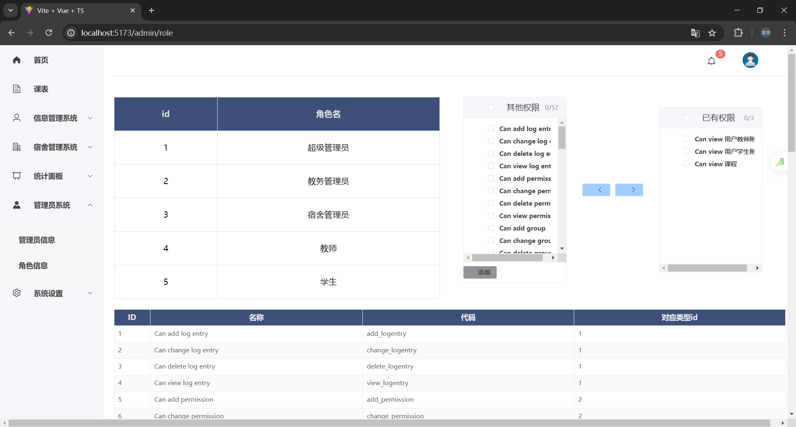

## Django Web课程设计

### 项目名称：基于Django的信息管理系统

### 项目简介：

本项目是一个基于Django的信息管理系统，主要功能包括用户登录、注册、信息的增删改查、信息的导入导出、信息的搜索等功能。

### 项目功能：

* 用户登录、注册
* 实体模型的增删改查
* 实体信息的导入导出
* 搜索
* 分页显示
* 数据统计
* 权限管理(RBAC)
* 日志管理
* 邮件通知
* 定时任务
* 缓存

### 项目结构：


```
DjangoWeb
├── backend
│   ├── backend
│   │   ├──  initSQL
│   │   │   └── education.sql
│   │   ├── __init__.py
│   │   ├── settings.py
│   │   ├── urls.py
│   │   └── wsgi.py
│   ├── manage.py
│   ├── README.md
│   ├── requirements.txt
│   ├── common
│   ├── courseSystem
│   └── infoSystem
├── frontend
│   ├── public
│   │   ├── favicon.ico
│   │   ├── index.html
| ................
```

### 项目技术：

* Django
* Django Admin
* Django ORM
* Django Middleware
* Django REST framework
* Django REST Auth
* Django REST Framework JWT
* Django REST Framework SimpleJWT

### 项目截图


<div style="text-align: center;">登录页面</div>


<div style="text-align: center;">首页</div>


<div style="text-align: center;">课表页</div>


<div style="text-align: center;">学生信息页</div>


<div style="text-align: center;">教师信息页</div>


<div style="text-align: center;">课程信息页</div>


<div style="text-align: center;">班级信息页</div>


<div style="text-align: center;">学院信息页</div>


<div style="text-align: center;">宿舍信息页(西区)</div>


<div style="text-align: center;">床位信息页</div>


<div style="text-align: center;">管理员信息页</div>



<div style="text-align: center;">角色信息页</div>


<div style="display: grid;grid-template-columns:1fr 1fr 1fr 1fr">
    
    
    
    
</div>
<div style="text-align: center;">不同角色在页面的差异</div>


<div style="text-align: center;">团队成员页(点击头像发起在线聊天)</div>


### 功能详情:

* 用户登录、注册
  * 用户登录
  * 用户注册
  * 用户注销

* 用户信息管理
  * 用户信息增加
  * 用户信息删除
  * 用户信息修改
  * 用户信息查询
  * 用户信息导入
  * 用户信息导出
  * 用户信息搜索
  * 用户信息分页
  * 用户信息排序

* 学生宿舍管理
  * 学生宿舍修改
  * 学生宿舍查询

* 角色管理
  * 角色增加
  * 角色删除
  * 角色修改
  * 角色查询

* 用户权限管理
  * 用户权限增加
  * 用户权限删除
  * 用户权限修改
  * 用户权限查询

* 用户日志管理
    * 用户登录日志
    * 用户操作日志

* 定时任务(内置AI模型)
    * 每三天统计一次学生的毕业去向(以产业类型分类)
    * 每月统计一次学生的就业去向(以公司类型分类)
    * 每月统计一次教师的研究方向(以研究领域分类)
    * 每月统计一次学生的学习情况(以课程分类)
    * 每月统计一次学生的学习情况(以学院分类)
    * 每周统计一次学生的健康情况(以宿舍分类)